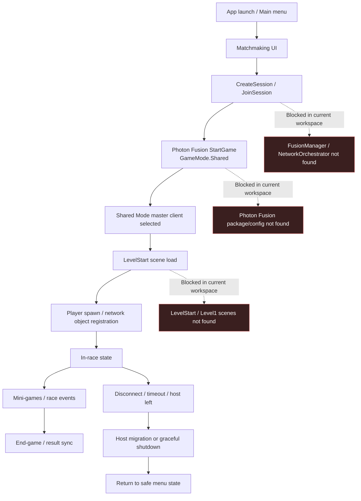

# Network Roadmap Audit Report

## 1. Executive summary

- Bu denetim, `Codex_Network_Roadmap_Audit_Prompt.md` icindeki Photon Fusion / Shared Mode ag audit hedefleri uygulanarak yapildi.
- Mevcut workspace, promptta tarif edilen production multiplayer codebase'i icermiyor: `Assets/_Project_` yok, `FusionManager`, `NetworkOrchestrator`, `ConnectionStateMachine`, `GameManager` ve matchmaking UI scriptleri bulunamadi.
- `Packages/manifest.json` icinde Photon Fusion, Firebase, Unity Authentication veya Friends dependency kaydi yok; yalnizca Unity template paketleri gorunuyor.
- `ProjectSettings/EditorBuildSettings.asset` sadece `Assets/Scenes/SampleScene.unity` sahnesini build'e dahil ediyor; `LevelStart`, `Level1` veya online akis sahneleri mevcut degil.
- Bu nedenle gercek online gameplay pipeline'i, host migration davranisi ve user-facing hata akislarinin kod uzerinden dogrulanmasi su an mumkun degil.
- Top 3 UX riski: online sistem dosyalarinin workspace'e dahil olmamasi, ag hata/timeout UI politikasinin kodda bulunmamasi, Photon Fusion config ve sahne akislarinin eksikligi nedeniyle test edilebilir multiplayer build uretilememesi.
- Hypothesis: Projenin asil multiplayer kodu baska bir branch, Plastic workspace, package veya dis asset olarak tutuluyor olabilir. Bunu dogrulamak icin kaynak kontrol mapping'i ve eksik asset/package import loglari kontrol edilmeli.

## 2. Gameplay x network flow diagram

Host authority matters most at `CreateSession / JoinSession`, `StartGame`, scene load ownership, spawn ownership, in-race replicated state, RPC/event routing, and disconnect/migration. In this workspace those points are audit targets, not verified implementation facts.

## 3. Issue register

| ID | Symptom | Likely cause | Severity | Evidence | Proposed fix | Test plan |
|---|---|---|---|---|---|---|
| NET-001 | Promptta listelenen online gameplay pipeline kodu denetlenemiyor. | Production source folders are missing from this workspace or not imported. | P0 | `Assets/_Project_` path not found; no `FusionManager`, `NetworkOrchestrator`, `ConnectionStateMachine`, `GameManager` search hits. | Asil multiplayer source tree'yi bu workspace'e ekle veya dogru branch/workspace'e gec. Minimum beklenen yollar: `Assets/_Project_/Scripts/Networking/Fusion/`, `Assets/_Project_/Scripts/Core/Services/Network/`, `Assets/_Project_/Scripts/Core/Managers/`, matchmaking UI folders. | `rg -n "class FusionManager|class NetworkOrchestrator|OnHostMigration|GameMode.Shared" Assets Packages` komutu gercek kodlari bulmali. Unity compile errors sifir olmali. |
| NET-002 | Photon Fusion Shared Mode davranisi ve host migration config'i dogrulanamiyor. | Photon Fusion dependency/config dosyalari workspace'te yok. | P0 | `Packages/manifest.json:2-13` Unity template dependencies lists; `Assets/Photon/Fusion/Resources/NetworkProjectConfig.fusion` bulunamadi. | Photon Fusion paketini ve `NetworkProjectConfig.fusion` asset'ini import et. Config'te tick rate, shutdown timeout, connection timeout, host migration enable/behavior alanlarini versiyon kontrolune al. | Unity Package Manager dependency restore sonrasi `NetworkProjectConfig.fusion` asset'i acilmali; Play Mode'da Shared Mode runner boot etmeli. |
| NET-003 | Firebase, Unity Authentication ve Friends invite akislarina ait hata/timeout UX'i denetlenemiyor. | Ancillary service packages and related scripts are absent. | P1 | `Packages/manifest.json:2-49` Firebase/Auth/Friends packages yok; `rg` search no relevant hits. | Service bootstrap kodlarini ve package dependency'lerini ekle. Invite/session join hata sonucunu `NetworkConnectionFailureReason` benzeri tek enum'a normalize et. | Auth disabled, friend invite expired, invalid room code ve offline network senaryolari icin UI smoke testleri calistir. |
| NET-004 | Build online sahne akisini temsil etmiyor. | Build settings sadece sample scene iceriyor. | P1 | `ProjectSettings/EditorBuildSettings.asset:7-10` only `Assets/Scenes/SampleScene.unity`. | `LevelStart`, `Level1`, menu/matchmaking/result scenes'i build settings'e ekle; scene names'i merkezi constants veya addressable references ile kullan. | Clean build alip create/join -> scene load -> spawn -> result -> menu akisini iki local client ile test et. |
| NET-005 | Kullaniciya gosterilecek ag hata mesajlari icin tek politika yok. | UI/network manager implementation absent; canonical copy source bulunmuyor. | P2 | `UiManager`, host-left flags, retry/return-to-menu panels not found. | `NetworkUserMessagePolicy` veya mevcut localization sisteminde canonical key set olustur: connecting, reconnecting, host migrated, host left, timeout, retry failed, return to menu. | Her network failure reason icin dogru localized copy, retry availability ve safe-state navigation test edilmeli. |
| NET-006 | Audit prompt dosyasinda Turkish text mojibake olarak gorunebiliyor. | File encoding or shell display mismatch. | P3 | `Codex_Network_Roadmap_Audit_Prompt.md` terminal output shows `Aşağıdaki` style mojibake. | Dosyayi UTF-8 olarak kaydet; repo editorconfig varsa `charset = utf-8` ekle. | PowerShell `Get-Content -Encoding UTF8` ve editor preview'da Turkce karakterler dogru gorunmeli. |

## 4. Roadmap

### Phase 0 (quick wins, <1 week)

- NET-001: Dogru production source tree'yi veya branch'i workspace'e getirin; once eksik `Assets/_Project_` ag/UI/manager klasorlerini geri kazanin.
- NET-002: Photon Fusion dependency ve `NetworkProjectConfig.fusion` asset'ini versiyon kontrolune alin.
- NET-004: Build settings'e menu, matchmaking, `LevelStart`, gameplay ve result sahnelerini ekleyin.
- NET-006: Prompt ve audit dokumanlarini UTF-8 olarak normalize edin.

### Phase 1 (stability)

- NET-005: Network hata mesajlari icin tek canonical policy tanimlayin; tum UI panelleri bu policy'den beslensin.
- NET-003: Auth/Friends/Firebase invite hata sonucunu tek connection failure modeline baglayin.
- NET-001: `FusionManager`, `NetworkOrchestrator`, `ConnectionStateMachine` ve `GameManager` icin state transition loglari ekleyin: session id, state, reason, runner state, scene name.
- NET-004: Iki local client ile create/join, host leave, client timeout, failed scene load smoke test suite'i olusturun.

### Phase 2 (host-quality / netcode hygiene)

- NET-002: `NetworkProjectConfig.fusion` degerlerini olculebilir hale getirin: tick rate, input rate, disconnect timeout, host migration timeout.
- NET-002: `[Networked]` field audit'i yapin; sik degisen veya buyuk payload'lari daha dusuk frekansli RPC/event veya local prediction modeline tasiyin.
- NET-001: Master client selection mumkunse cihaz kalitesi, ping, foreground state ve battery/thermal sinyallerini dikkate alan secim metriği ekleyin.
- NET-003: Focus loss/background davranisini olcun; migration'i nadir ve tahmin edilebilir kılmak icin graceful pause/reconnect timeoutlarini ayarlayin.

### Phase 3 (optional larger refactors)

- NET-005: Network UX overlay'i sahne bagimsiz, tekil ve idempotent bir UI service'e tasiyin.
- NET-001: Scene load ve Fusion callbacks arasina explicit async gate koyun: runner valid, scene loaded, services ready, player spawned.
- NET-003: Analytics event schema'sini standartlastirin: `network_error`, `reconnect_attempt`, `host_migration_started`, `host_migration_completed`, `safe_return_to_menu`.
- NET-002: Dedicated server veya Photon pricing tier degisikligi yalnizca metrikler Shared Mode'un kabul edilemez oldugunu gosterdiginde future spike olarak degerlendirilsin.

## 5. User-facing copy guidelines

- `Connecting...`: Sadece aktif create/join denemesi surerken goster; 10-15 saniye sonra timeout veya retry state'e gec.
- `Reconnecting...`: Runner hala recoverable durumda ve otomatik yeniden baglanma deneniyorsa goster; iptal ve menuye donus yolu her zaman gorunur olsun.
- `Host migrated. Resuming match...`: Kisa ve tercihen pasif bildirim; oyuncu aksiyonu gerekiyorsa explicit modal'a yukseltilir.
- `Host left. Returning to menu.`: Migration basarisiz veya oturum artik recoverable degilse goster.
- `Connection timed out. Try again?`: Matchmaking/join timeout icin retry + return to menu secenekleriyle goster.
- `Match no longer available.`: Session closed, invite expired veya room not found icin kullan.
- `Something went wrong online. Your progress is safe.`: Beklenmeyen shutdown/orphan state durumunda panik yaratmadan safe-state'e don.

Always exit to a safe state on failure: matchmaking panel, loading screen, `LevelStart`, gameplay HUD, mini-game overlay, result screen, invite/friends flow, reconnect overlay. Bu ekranlar sonsuz spinner, siyah ekran veya kapatilamayan modal birakmamalidir.

## 6. Explicit non-goals for this audit

- Dedicated Fusion Server'a gecis tasarlamak bu auditin hedefi degil.
- Photon dashboard, pricing tier veya cloud-side ayarlari hakkinda varsayim yapilmadi.
- Mevcut workspace'te bulunmayan `FusionManager`, `NetworkOrchestrator`, `GameManager` veya UI kodlari hakkinda satir bazli davranis uydurulmadi.
- Offline/single-player gameplay design kapsam disi tutuldu.
- Buyuk mimari rewrite onerilmedi; once eksik production source/config'in workspace'e dahil edilmesi gerekiyor.
