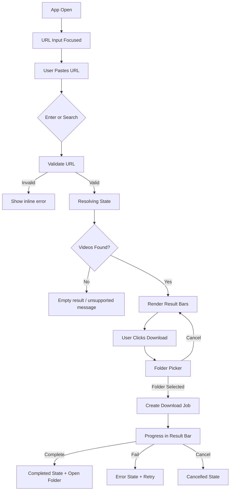
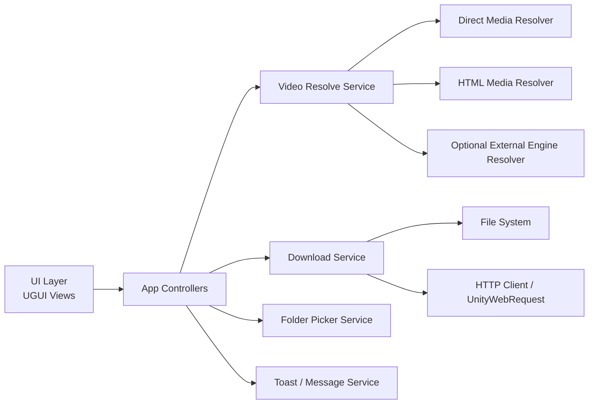

# Vidow - Unity Video Resolver & Downloader

Super detayli GDD + dev/designer uygulama dokumani  
Hedef: Unity'ye bagli bir AI agent'in projeyi bastan sona profesyonel, guzel gorunen ve calisan bir masaustu uygulamasi olarak uretebilmesi.

---

## 0. Kisa Ozet

Vidow, kucuk pencere modunda calisan, tek ekranda URL alan, ilgili linkteki indirilebilir video veya video listesini bulan ve kullaniciya guzel, responsive bar listesi olarak sunan bir Unity desktop utility uygulamasidir.

Kullanici akisi:

1. Kullanici uygulamayi acar.
2. Ustteki URL inputuna bir link yapistirir veya yazar.
3. `Enter` ya da `Search` butonuna basar.
4. Uygulama linki analiz eder.
5. Bulunan video/video'lar listelenir.
6. Her video satirinda thumbnail, baslik, kaynak, sure/boyut/kalite bilgisi ve `Download` butonu gorunur.
7. Kullanici `Download` der.
8. Uygulama dosya yolu/folder picker acar.
9. Kullanici indirme klasorunu secer.
10. Uygulama indirmeyi baslatir, progress/speed/ETA gosterir.
11. Bitince satir `Completed` olur, `Open Folder` ve `Reveal File` aksiyonlari sunulur.

Temel tasarim hedefi: "Kucuk, temiz, hizli, guven veren, modern masaustu araci." Landing page yok; ilk ekran direkt calisan uygulama.

---

## 1. Urun Vizyonu

### 1.1 Uygulama Tanimi

Vidow, kullanicinin yetkili oldugu veya indirilmesine izin verilen video iceriklerini tek URL uzerinden bulup indirmesine yardimci olan kompakt bir masaustu aracidir. Unity ile uretilir; amaci oyun hissi vermek degil, kaliteli bir native utility hissi vermektir.

### 1.2 Hedef Kullanici

- Video dosyalarini kendi arsivine indirmek isteyen kullanici.
- Kendi web sayfasindaki veya kendi CDN'indeki video dosyalarini hizlica almak isteyen creator/developer.
- Egitim, demo, test, public domain veya Creative Commons gibi indirilmesine izin verilen kaynaklarla calisan kullanici.
- Teknik bilgisi az olan ama temiz, guvenilir bir UI ile isini bitirmek isteyen kullanici.

### 1.3 Tasarim Ilkeleri

- Tek ekran, tek is: URL gir, bul, indir.
- Kucuk pencere boyutunda bile okunabilir ve kullanilabilir.
- Kullanici asla sonsuz loader'da kalmaz.
- Her hata icin net mesaj ve cikis yolu vardir.
- Indirme islemi buyuk dosyalarda bile UI'i dondurmaz.
- Her dosya once gecici `.part` dosyasina iner; tamamlaninca final isme tasinir.
- Uygulama "her siteyi her kosulda indirir" iddiasi tasimaz; izinli ve desteklenen kaynaklari indirir.

---

## 2. Guvenlik, Yasal ve Platform Sinirlari

Bu bolum agent icin zorunludur. Uygulama, DRM veya paywall asma araci olarak tasarlanmayacak.

### 2.1 Desteklenen Icerik Kapsami

Uygulama su kaynaklari destekleyebilir:

- Direkt video dosyasi URL'leri: `.mp4`, `.webm`, `.mov`, `.m4v`, `.ogg`, `.ogv`.
- HTML sayfasinda acikca yayinlanan ve indirilmesine izin verilen video kaynaklari.
- Kullaniciya ait CDN/storage linkleri.
- Public domain veya lisansi indirmeye izin veren kaynaklar.
- Platformun resmi API'si veya acik download endpoint'i ile izin verdigi icerikler.
- DRM'siz ve izinli HLS/DASH stream'leri, sadece opsiyonel download engine varsa.

### 2.2 Desteklenmeyen Icerik

Uygulama su islemleri yapmayacak:

- DRM kirma.
- Paywall, subscription veya login gerektiren korumayi asma.
- Sifre, cookie, token veya kullanici hesabi ele gecirme.
- Platformun indirmeye izin vermedigi icerigi zorla indirme.
- Siteden siteye ozel signature/anti-bot bypass kodu yazma.
- "Her video indirilebilir" gibi yaniltici mesaj gosterme.

### 2.3 UI'da Gosterilecek Net Mesaj

Unsupported kaynaklarda:

`This video cannot be downloaded by Vidow. It may be protected, private, paid, or unsupported.`

Turkce localize karsiligi:

`Bu video Vidow ile indirilemiyor. Korumali, ozel, ucretli ya da desteklenmeyen bir kaynak olabilir.`

### 2.4 Agent'a Uygulama Kuralı

Agent, uygulamayi "izinli video indirme araci" olarak inşa edecek. Site korumasi asma, DRM kirma veya platform kisitlamalarini bypass etme kodu yazmayacak. Harici arac entegrasyonu yapilacaksa feature flag arkasinda olacak ve sadece desteklenen/izinli kaynaklarda kullanilacak.

---

## 3. Platform ve Teknik Hedefler

### 3.1 Ilk Hedef Platform

- Windows x64 standalone build.
- Unity Editor: mevcut projede `6000.3.10f1` gorunuyor, bu versiyon hedef alinmali.
- Pencere modu varsayilan.
- Resizable window aktif.

### 3.2 Sonraki Platformlar

- macOS standalone.
- Linux standalone.

Bu platformlar Phase 2+ hedefidir. Ilk implementasyon Windows odakli olabilir, ancak kod platform soyutlamasina hazir yazilmalidir.

### 3.3 Varsayilan Pencere Boyutu

- Default: `560 x 720`
- Minimum: `420 x 560`
- Ideal compact: `520 x 680`
- Genis mod: `720 x 820`

Uygulama tam ekran hissi vermemeli. Kucuk desktop tool gibi acilmali.

### 3.4 Unity UI Teknolojisi

Tercih:

- UGUI + TextMeshPro.
- Canvas: `Screen Space - Overlay`.
- Canvas Scaler:
  - UI Scale Mode: `Scale With Screen Size`
  - Reference Resolution: `560 x 720`
  - Match: `0.5`

Alternatif:

- UI Toolkit kullanilabilir; ancak mevcut projede hizli ve guvenli implementasyon icin UGUI daha pratik.

---

## 4. Ana Kullanici Deneyimi

### 4.1 Birincil Flow



### 4.2 App Acilis Davranisi

Ilk acilista:

- URL input aktif/focused.
- Placeholder gorunur: `Paste a video page or direct media URL`
- Search butonu disabled olabilir, input valid olana kadar.
- Son indirilen klasor varsa altta kucuk bir path chip olarak gorunebilir.
- Result list bosken guzel bir empty state gorunur.

Empty state metni:

`Paste a link to find downloadable videos.`

Alt metin:

`Direct media URLs and permitted public video sources work best.`

### 4.3 URL Giris Davranisi

Input:

- Paste destekler.
- `Ctrl+A`, `Ctrl+C`, `Ctrl+V` normal calisir.
- `Enter` search'i tetikler.
- Bos inputta search calismaz.
- Invalid URL'de input altinda error gorunur.

Validation:

- `http://` veya `https://` kabul edilir.
- Sadece domain yazildiysa otomatik `https://` eklenebilir.
- Local file path MVP'de desteklenmez.
- `javascript:`, `data:`, `file:` gibi scheme'ler reddedilir.

Invalid mesaj:

`Enter a valid http or https URL.`

### 4.4 Resolve/Arama Davranisi

Search basladiginda:

- Search butonu spinner haline gelir.
- Input kilitlenmez; ama yeni search baslatilirsa onceki resolve iptal edilir.
- Sonuclar temizlenmeden once ustte "Resolving..." state gorunur.
- 20 saniye resolve timeout.
- Timeout'ta retry butonu gorunur.

Timeout mesaj:

`This link took too long to analyze. Check the address or try again.`

### 4.5 Sonuc Listesi

Her sonuc yatay bir bar olarak gorunur.

Bar bilgileri:

- Thumbnail veya placeholder.
- Video basligi.
- Kaynak domain.
- Sure.
- Dosya tipi/kalite.
- Tahmini boyut, biliniyorsa.
- Status badge.
- Download butonu.

Bar durumu:

- Ready
- Resolving details
- Unsupported
- Queued
- Downloading
- Paused
- Completed
- Failed
- Cancelled

### 4.6 Download Flow

Download butonuna basinca:

1. Folder picker acilir.
2. Kullanici klasor secer.
3. Dosya adi otomatik uretilir.
4. Ayni isimde dosya varsa suffix eklenir: `video-name (1).mp4`
5. Indirme `.part` dosyasina baslar.
6. Progress bar, yuzde, hiz, kalan sure guncellenir.
7. Basariyla biterse `.part` final dosyaya rename edilir.
8. `Open Folder` ve `Copy Path` ikonlari aktif olur.

Folder picker cancel:

- Indirme baslamaz.
- Satir eski Ready durumuna doner.
- Toast: `Download cancelled.`

### 4.7 Download Progress

Progress satiri su bilgileri gostermeli:

- `42%`
- `8.4 MB / 20.0 MB`
- `1.8 MB/s`
- `~7s left`

Boyut bilinmiyorsa:

- Indeterminate progress animasyonu.
- Sadece indirilen miktar ve hiz:
  - `8.4 MB downloaded`
  - `1.8 MB/s`

### 4.8 Coklu Video

Bir URL birden fazla video iceriyorsa:

- Tum videolar listeye eklenir.
- Ustte result summary:
  - `6 videos found`
- Her satir ayri download edilir.
- Opsiyonel `Download All` butonu Phase 1 hedefidir.

MVP'de:

- Tek tek download yeterlidir.
- Coklu sonuc listelenmelidir.

---

## 5. UI Tasarim Sistemi

### 5.1 Genel His

Modern, kompakt, profesyonel desktop utility.

Kelime seti:

- Sharp
- Calm
- Reliable
- Focused
- Fast

Kacinilacaklar:

- Buyuk landing hero.
- Dekoratif orb/gradient blob.
- Fazla oyunlastirilmis UI.
- Devasa kartlar.
- Tek renk mor/mavi gradient baskinligi.
- Kart icinde kart.
- Gereksiz aciklama metinleri.

### 5.2 Renk Paleti

Ana tema dark-neutral.

```text
Background main:       #101316
Surface raised:        #181D22
Surface hover:         #20262D
Border subtle:         #303842
Text primary:          #F1F5F9
Text secondary:        #A9B4C0
Text muted:            #6F7A86
Accent primary:        #35C2FF
Accent success:        #43D17A
Accent warning:        #F4B740
Accent danger:         #F35F5F
Focus ring:            #7DDCFF
Progress track:        #27313A
```

Not:

- Accent mavi kullanilabilir ama tum UI maviye bogulmayacak.
- Basari yesili, warning sari, danger kirmizi net kullanilacak.
- Arka plan cok koyu ama kontrast yeterli olacak.

### 5.3 Tipografi

Tercih:

- TextMeshPro default font yerine modern bir sans font asset uretilsin veya import edilsin.
- Eger yeni font eklenemiyorsa TextMeshPro default temiz ayarlansin.

Boyutlar:

```text
App title:              18-20 px / semibold
Input text:             15-16 px / regular
Button label:           14-15 px / semibold
Result title:           14-15 px / semibold
Result metadata:        12-13 px / regular
Badge text:             11-12 px / medium
Footer/helper text:     11-12 px / regular
```

Metin tasma kurali:

- Baslik tek satirda ellipsis ile kisaltilir.
- Tooltip'te tam baslik gorunur.
- Metadata satiri responsive olarak gizlenebilir.
- Buton metni asla buton disina tasmayacak.

### 5.4 Spacing

```text
Window padding:         16 px compact, 20 px wide
Section gap:            12 px
Input row height:       44 px
Icon button:            36 x 36 px
Primary button height:  40-44 px
Result bar height:      84 px compact, 92 px wide
Thumbnail:              96 x 54 px compact, 112 x 63 px wide
Border radius:          8 px max
```

### 5.5 Icon Set

Unity icinde vector sprite veya texture olarak uretilecek ikonlar:

- Search
- Download
- Folder
- Link
- Paste
- Clear/X
- Retry
- Cancel
- Check
- Warning
- Info
- Open folder
- Copy path
- Play placeholder
- Spinner frames or radial loader

Ikon stili:

- 1.75 px stroke hissi.
- Round caps olabilir.
- Tek renk, UI state'e gore tint.
- Butonlarda ikon + tooltip.
- Search ve Download gibi ana aksiyonlarda ikon + text kullanilabilir.

### 5.6 Gorsel Assetler

Agent tum gorselleri uretmeli:

```text
Assets/Vidow/Art/Icons/
Assets/Vidow/Art/Logo/
Assets/Vidow/Art/Placeholders/
Assets/Vidow/Art/UI/
```

Zorunlu assetler:

- `vidow_logo_mark.png`: kucuk play/link temali logo.
- `thumbnail_placeholder.png`: video bulununca thumbnail yoksa kullanilir.
- `unsupported_thumbnail.png`: desteklenmeyen kaynak icin sade placeholder.
- `download_complete_badge.png` veya runtime UI badge.
- UI ikonlari.

Thumbnail placeholder:

- Koyu yuzey.
- Ortada play ucgeni.
- Subtle diagonal texture olabilir.
- Gercek video gibi yaniltici olmayacak.

---

## 6. Ana Ekran Layout

### 6.1 Hierarchy

Tek scene:

```text
VidowAppScene
  EventSystem
  AppRootCanvas
    SafeAreaRoot
      Header
        Logo
        AppTitle
        WindowStatusText
      SearchPanel
        UrlInputContainer
          UrlInput
          ClearButton
        SearchButton
      InlineMessageArea
      ResultsHeader
        ResultsCountText
        SortOrFilterOptional
      ResultsScrollView
        Viewport
          Content
            ResultItemPrefab instances
      FooterStatusBar
        DefaultDownloadPathChip
        NetworkStatusDot
        SettingsButton
  Systems
    AppBootstrapper
    VideoResolveController
    DownloadController
    ToastController
    FolderPickerService
```

### 6.2 Header

Height: 56 px.

Icerik:

- Sol: logo mark.
- Yaninda `Vidow`.
- Alt/yan status:
  - Idle: `Ready`
  - Resolve: `Analyzing link...`
  - Downloading: `Downloading 1 item`
  - Offline: `Network unavailable`

Header sade olmali; app'in esas islevi input/list olacaktir.

### 6.3 Search Panel

Search panel pencerenin en kritik bolumu.

Layout:

```text
[ link icon ][ URL input............................ ][ x ][ Search ]
```

Compact width:

- Search butonu sadece ikon olabilir.
- Tooltip: `Search`

Wide width:

- Search butonu ikon + `Search`.

Input states:

- Normal
- Focused
- Invalid
- Resolving

Focused input:

- 1 px border accent.
- Hafif focus ring.

Invalid:

- Border danger.
- Alt mesaj danger.

### 6.4 Inline Message Area

Search panel altinda 24-48 px esnek alan.

Mesaj tipleri:

- Info
- Warning
- Error
- Success

Ornek:

`No downloadable videos found on this page.`

### 6.5 Results Header

Sonuc varsa gorunur:

- `3 videos found`
- Opsiyonel:
  - `Clear`
  - `Download All` Phase 1

Sonuc yokken gizlenebilir.

### 6.6 Results ScrollView

Barlar dikey liste.

Scrollbar:

- Ince.
- Hover'da biraz belirgin.

Content:

- 8 px vertical spacing.
- Bottom padding 16 px.

### 6.7 Footer Status Bar

Alt bar:

- Son secilen klasor chip'i.
- Internet status dot.
- Settings ikonu.

Footer optional ama profesyonel his verir.

---

## 7. Result Item Prefab Detayi

### 7.1 Normal Ready State

```text
┌──────────────────────────────────────────────────────────┐
│ [ thumbnail 16:9 ]  Video title truncated...       [↓]   │
│                  source.com · 03:21 · MP4 · 1080p        │
│                  Ready                                  │
└──────────────────────────────────────────────────────────┘
```

Elementler:

- Thumbnail sol.
- Title ust.
- Metadata orta.
- Status badge alt/orta.
- Download button sag.

### 7.2 Compact Width Davranisi

420-500 px:

- Thumbnail 76 x 43 olabilir.
- Metadata kisa:
  - `03:21 · MP4`
- Download butonu ikon only.
- Title ellipsis.

### 7.3 Wide Width Davranisi

650+ px:

- Thumbnail 112 x 63.
- Download butonu ikon + `Download`.
- Extra metadata gorunebilir:
  - `1080p · 24.8 MB`

### 7.4 Downloading State

```text
┌──────────────────────────────────────────────────────────┐
│ [ thumbnail ]  Video title...                    [Stop]  │
│              42% · 8.4 MB / 20.0 MB · 1.8 MB/s           │
│              [=========-------------]                    │
└──────────────────────────────────────────────────────────┘
```

Buton:

- Download yerine cancel/stop icon.

Progress:

- Alt kisimda ince progress bar.
- Progress text net.

### 7.5 Completed State

Butonlar:

- `Open Folder`
- `Copy Path`

Badge:

- Green check.
- `Completed`

### 7.6 Failed State

Butonlar:

- `Retry`
- `Details` optional.

Mesaj:

- Kisa hata metni bar icinde.
- Tam teknik hata log'da veya details popover'da.

---

## 8. Screen States

### 8.1 Empty State

Gorunum:

- Ortada thumbnail placeholder/play icon.
- Kisa metin:
  - `Paste a link to find downloadable videos.`
- Alt metin:
  - `Direct media URLs and permitted public video sources work best.`

### 8.2 Resolving State

Gorunum:

- Liste alaninda skeleton bars.
- Header status: `Analyzing link...`
- Search button spinner.

Skeleton:

- 2-3 yatay placeholder bar.
- Hafif shimmer olabilir, ama abartili degil.

### 8.3 No Results

Mesaj:

`No downloadable videos were found.`

Alt mesaj:

`The page may not contain a supported media file, or the video may be protected.`

Aksiyon:

- `Try another link`
- Input focus'a geri doner.

### 8.4 Network Error

Mesaj:

`Could not reach this link. Check your connection and try again.`

Aksiyon:

- Retry.

### 8.5 Unsupported Source

Mesaj:

`This source is not supported for download.`

Alt:

`Vidow only downloads videos when the source allows it and no protection is bypassed.`

### 8.6 Download Path Error

Mesaj:

`Vidow cannot write to this folder. Choose another location.`

Nedenler:

- Permission denied.
- Disk full.
- Folder missing.
- File locked.

### 8.7 App Offline

Footer:

- Kirmizi/sari dot.
- `Offline`

Search denemesinde:

`You appear to be offline. Connect to the internet and try again.`

---

## 9. Canonical UI Copy

### 9.1 Buttons

```text
Search
Download
Retry
Cancel
Open Folder
Copy Path
Clear
Choose Folder
Try Another Link
```

### 9.2 Status Badges

```text
Ready
Analyzing
Queued
Downloading
Completed
Failed
Cancelled
Unsupported
```

### 9.3 Toasts

```text
Link copied.
Download started.
Download cancelled.
Download complete.
Folder opened.
Could not open folder.
Path copied.
```

### 9.4 Error Messages

```text
Enter a valid http or https URL.
This link took too long to analyze. Check the address or try again.
No downloadable videos were found.
This video cannot be downloaded by Vidow. It may be protected, private, paid, or unsupported.
Vidow cannot write to this folder. Choose another location.
The download failed. Check your connection and try again.
There is not enough free space in the selected folder.
```

---

## 10. Teknik Mimari

### 10.1 High-Level Architecture



### 10.2 Namespace

Tum yeni kodlar:

```text
Vidow
Vidow.UI
Vidow.Resolve
Vidow.Downloads
Vidow.Platform
Vidow.Data
Vidow.Utilities
```

### 10.3 Klasor Yapisi

```text
Assets/Vidow/
  Art/
    Icons/
    Logo/
    Placeholders/
    UI/
  Materials/
  Prefabs/
    AppRootCanvas.prefab
    ResultItemView.prefab
    ToastView.prefab
    SkeletonResultItem.prefab
  Scenes/
    VidowApp.unity
  Scripts/
    App/
      AppBootstrapper.cs
      AppState.cs
      AppEvents.cs
    UI/
      MainView.cs
      UrlInputView.cs
      ResultListView.cs
      ResultItemView.cs
      ToastController.cs
      ResponsiveLayoutController.cs
      ProgressBarView.cs
      EmptyStateView.cs
    Resolve/
      IVideoResolver.cs
      VideoResolveService.cs
      DirectMediaResolver.cs
      HtmlMediaResolver.cs
      OptionalExternalResolver.cs
      ResolveTimeoutPolicy.cs
    Downloads/
      IDownloadService.cs
      DownloadService.cs
      DownloadJob.cs
      DownloadQueue.cs
      DownloadProgress.cs
      FileNameSanitizer.cs
    Platform/
      IFolderPickerService.cs
      WindowsFolderPickerService.cs
      FallbackFolderPickerService.cs
      PlatformOpener.cs
    Data/
      VideoItem.cs
      VideoSourceInfo.cs
      ResolveResult.cs
      DownloadResult.cs
    Utilities/
      UrlValidator.cs
      ByteFormatter.cs
      TimeFormatter.cs
      DomainFormatter.cs
      SafePath.cs
  Settings/
    VidowSettings.asset
```

---

## 11. Data Models

### 11.1 VideoItem

```csharp
public sealed class VideoItem
{
    public string Id;
    public string PageUrl;
    public string MediaUrl;
    public string Title;
    public string SourceDomain;
    public string ThumbnailUrl;
    public string Extension;
    public string MimeType;
    public string QualityLabel;
    public long? SizeBytes;
    public TimeSpan? Duration;
    public bool IsDownloadable;
    public string UnsupportedReason;
}
```

### 11.2 ResolveResult

```csharp
public sealed class ResolveResult
{
    public string InputUrl;
    public ResolveStatus Status;
    public List<VideoItem> Videos;
    public string UserMessage;
    public string TechnicalMessage;
}
```

### 11.3 ResolveStatus

```csharp
public enum ResolveStatus
{
    Success,
    InvalidUrl,
    NoVideosFound,
    UnsupportedSource,
    NetworkError,
    Timeout,
    Cancelled,
    Failed
}
```

### 11.4 DownloadJob

```csharp
public sealed class DownloadJob
{
    public string JobId;
    public VideoItem Video;
    public string TargetDirectory;
    public string FinalFilePath;
    public string TempFilePath;
    public DownloadStatus Status;
    public DownloadProgress Progress;
}
```

### 11.5 DownloadStatus

```csharp
public enum DownloadStatus
{
    Queued,
    Downloading,
    Completed,
    Failed,
    Cancelled
}
```

### 11.6 DownloadProgress

```csharp
public sealed class DownloadProgress
{
    public long BytesDownloaded;
    public long? TotalBytes;
    public float? Percent;
    public double BytesPerSecond;
    public TimeSpan? EstimatedTimeRemaining;
}
```

---

## 12. Resolver Davranisi

### 12.1 Resolver Pipeline

`VideoResolveService` sirayla sunlari dener:

1. URL validation.
2. Direct media resolver.
3. HTML media resolver.
4. Optional external resolver, feature flag aciksa.
5. No result veya unsupported doner.

### 12.2 DirectMediaResolver

Destekler:

- URL path uzantisi video ise.
- HTTP HEAD ile `Content-Type: video/*` gelirse.
- `Content-Length` varsa size hesaplar.

Davranis:

- Tek `VideoItem` doner.
- Title dosya adindan uretilir.
- Thumbnail yoksa placeholder kullanilir.

### 12.3 HtmlMediaResolver

Destekler:

- `<video src="...">`
- `<source src="..." type="video/mp4">`
- `og:video`
- `twitter:player:stream`

Kurallar:

- Relative URL'ler absolute'a cevrilir.
- Duplicate media URL'ler tekilleştirilir.
- Unknown media tipleri unsupported olabilir.
- HTML parse icin mumkunse structured parser kullanilir; regex son care.

### 12.4 OptionalExternalResolver

Bu resolver feature flag arkasinda olmalidir:

```text
VidowSettings.EnableExternalResolver = false by default
```

Amaci:

- Izinli ve desteklenen kaynaklar icin metadata ve download endpoint bulmak.

Kisit:

- DRM/paywall/login bypass yok.
- Kullanici cookie import yok.
- Unsupported durumunda net mesaj.

### 12.5 Timeout Policy

```text
URL validation:          instant
HEAD request:            8s
HTML GET:                15s
Full resolve operation:  20s
Thumbnail fetch:         8s, fail silently to placeholder
```

---

## 13. Download Service

### 13.1 Download Implementation

MVP:

- `UnityWebRequest` + `DownloadHandlerFile`.
- Dosya once `.part` olarak iner.
- Tamamlaninca final dosya adina rename edilir.
- Cancel edilirse `.part` silinir.

### 13.2 File Naming

Dosya adi:

```text
{sanitized-title}.{extension}
```

Sanitization:

- Invalid path chars kaldirilir.
- Cok uzun ad 120 karaktere kisaltilir.
- Bos title ise domain + timestamp kullanilir.

Duplicate:

```text
video.mp4
video (1).mp4
video (2).mp4
```

### 13.3 Progress Calculation

- `downloadedBytes`
- `Content-Length`
- son 3-5 saniye hareketli ortalama speed.
- ETA = remaining / speed.

### 13.4 Queue

MVP:

- Ayni anda maksimum 2 download.
- Fazlasi queued.

Settings:

```text
MaxConcurrentDownloads = 2
```

### 13.5 Cancel

Cancel:

- Request abort.
- Temp file cleanup.
- UI `Cancelled` state.

### 13.6 Error Handling

Error map:

```text
ConnectionError -> network message
ProtocolError  -> source unavailable / permission / server error
DataProcessingError -> download failed
DiskFull -> not enough space
UnauthorizedAccess -> cannot write folder
PathTooLong -> choose shorter path
```

---

## 14. Folder Picker

### 14.1 Windows

Tercih sirasi:

1. Native folder picker plugin.
2. Windows-specific folder picker implementation.
3. Fallback in-app path input modal.

MVP icin en pratik:

- `StandaloneFileBrowser` benzeri Unity plugin kullanilabilir.
- Plugin eklenmezse Windows Forms `FolderBrowserDialog` sadece Windows build'de kullanilabilir.
- Editor'da test icin `UnityEditor.EditorUtility.OpenFolderPanel` sadece `#if UNITY_EDITOR` ile kullanilir.

### 14.2 Fallback Modal

Native picker calismazsa:

- Modal acilir.
- Path input.
- `Browse not available` helper text.
- `Choose` butonu path var ve writable ise aktif.

### 14.3 Son Klasor Hatirlama

`PlayerPrefs`:

```text
Vidow.LastDownloadDirectory
```

Footer'da kisa path:

`Downloads`

Tooltip:

Tam path.

---

## 15. Responsive Davranis

### 15.1 Breakpoints

```text
Compact: < 500 px width
Normal:  500-639 px width
Wide:    >= 640 px width
```

### 15.2 Compact

- Header title kalir, secondary status kisalir.
- Search button icon only.
- Result metadata kisaltilir.
- Download button icon only.
- Footer path chip ellipsis.

### 15.3 Normal

- Search button icon + `Search`.
- Result item title + metadata + status.
- Download button icon + text olabilir.

### 15.4 Wide

- Daha buyuk thumbnail.
- Daha fazla metadata.
- `Download All` icin yer acilir.

### 15.5 Height Responsiveness

Kisa pencere:

- Header sabit.
- Search panel sabit.
- Results list kalan alani doldurur.
- Footer minimum height ile kalir veya gizlenir.

---

## 16. Motion ve Feedback

Animasyonlar profesyonel ve hafif olacak.

### 16.1 Kullanilacak Animasyonlar

- Button hover: 100 ms color/scale subtle.
- Input focus border: 120 ms.
- Result item appear: 120 ms fade + 6 px slide.
- Progress bar smooth fill.
- Toast: 160 ms fade/slide.
- Skeleton shimmer: yavas, dusuk opacity.

### 16.2 Kacinilacak Animasyonlar

- Ziplayan butonlar.
- Abartili particle.
- Surekli goz alan glow.
- Buyuk UI kaymalari.

---

## 17. Accessibility

Zorunlu:

- Klavye ile input ve search kullanilabilir.
- `Enter` search.
- `Esc` modal kapatir veya aktif resolve'u iptal eder.
- Tab order mantikli.
- Kontrast WCAG AA'ya yakin.
- Icon-only butonlarda tooltip.
- Error sadece renkle anlatilmaz; metin de vardir.

Keyboard shortcuts:

```text
Ctrl+L: URL input focus
Enter: Search
Esc: Cancel current resolve / close modal
Ctrl+O: Open selected completed file folder, optional
```

---

## 18. Settings

MVP settings UI minimum olabilir, ama backend ayarlar asset'te tutulmali.

`VidowSettings.asset`:

```text
DefaultWindowWidth = 560
DefaultWindowHeight = 720
MinWindowWidth = 420
MinWindowHeight = 560
ResolveTimeoutSeconds = 20
RequestTimeoutSeconds = 15
ThumbnailTimeoutSeconds = 8
MaxConcurrentDownloads = 2
EnableExternalResolver = false
RememberLastDirectory = true
```

Settings button Phase 1:

- Default download folder.
- Concurrent downloads.
- External resolver enable/disable.
- Theme toggle optional.

---

## 19. Analytics ve Logging

Production olmasa bile local log gerekli.

Log path:

```text
Application.persistentDataPath/Vidow/logs/
```

Eventler:

```text
app_started
url_submitted
resolve_started
resolve_completed
resolve_failed
download_folder_selected
download_started
download_progress_sample
download_completed
download_failed
download_cancelled
unsupported_source
```

Log format:

- timestamp
- event name
- source domain
- status
- non-sensitive error code

URL privacy:

- Full URL loglama default kapali.
- Sadece domain loglanir.

---

## 20. Scene ve Prefab Uretim Gorevleri

Agent su varliklari uretmeli:

### 20.1 Scene

```text
Assets/Vidow/Scenes/VidowApp.unity
```

Icerik:

- EventSystem.
- AppRootCanvas.
- Systems game object.
- Camera gerekiyorsa sade camera.

Build Settings:

- `VidowApp.unity` ilk ve tek scene olarak eklenmeli.

### 20.2 Prefabs

```text
Assets/Vidow/Prefabs/AppRootCanvas.prefab
Assets/Vidow/Prefabs/ResultItemView.prefab
Assets/Vidow/Prefabs/ToastView.prefab
Assets/Vidow/Prefabs/SkeletonResultItem.prefab
```

### 20.3 Materials / Sprites

```text
Assets/Vidow/Art/Icons/*.png
Assets/Vidow/Art/Logo/vidow_logo_mark.png
Assets/Vidow/Art/Placeholders/thumbnail_placeholder.png
Assets/Vidow/Art/Placeholders/unsupported_thumbnail.png
```

### 20.4 Scripts

Tum scriptler compile edilmeli; namespace tutarli olmali.

---

## 21. Implementation Phases

### Phase 0 - Project Setup

- `Assets/Vidow` klasor yapisini olustur.
- Scene olustur.
- Canvas ve EventSystem kur.
- Player settings:
  - Windowed default.
  - Resizable window.
  - Default resolution 560x720.
- Basic theme colors ve UI sprites.

Acceptance:

- Unity Play Mode'da Vidow ekrani acilir.
- Input focus gelir.
- Build settings dogru scene'i icerir.

### Phase 1 - Static UI & Responsive Layout

- Header.
- URL input.
- Search button.
- Empty state.
- Results scroll view.
- Result item prefab.
- Toast system.
- Responsive breakpoints.

Acceptance:

- 420 px, 560 px, 720 px genisliklerde UI tasma yapmaz.
- Buton metinleri kesilmez veya bilincli icon-only olur.
- Empty state guzel gorunur.

### Phase 2 - URL Validation & Resolve

- `UrlValidator`.
- `DirectMediaResolver`.
- `HtmlMediaResolver`.
- Resolve timeout.
- Thumbnail loading.
- Error states.

Acceptance:

- Direkt `.mp4` URL tek item olarak listelenir.
- HTML icindeki `<video>` kaynaklari listelenir.
- Invalid URL error verir.
- Unsupported kaynakta net mesaj verir.

### Phase 3 - Download System

- Folder picker service.
- Download queue.
- Download progress.
- Temp `.part` file.
- Cancel.
- Completed state.
- Open folder/copy path.

Acceptance:

- Direkt video dosyasi secilen klasore iner.
- UI indirme sirasinda donmaz.
- Cancel temp file'i temizler.
- Ayni isimde dosyada suffix ekler.

### Phase 4 - Polish

- Icons final.
- Placeholder thumbnails.
- Hover/focus animations.
- Skeleton loader.
- Toast polish.
- Keyboard shortcuts.
- Logs.

Acceptance:

- Uygulama profesyonel desktop utility hissi verir.
- Hatalar kullaniciyi kilitlemez.
- QA checklist tamamlanir.

### Phase 5 - Optional External Resolver

- Feature flag.
- Guvenli integration wrapper.
- Metadata parse.
- Unsupported/legal mesajlari.

Acceptance:

- Default kapali.
- Acilinca sadece izinli kaynaklarda kullanilir.
- DRM/paywall/login bypass yok.

---

## 22. QA Test Plani

### 22.1 UI Tests

- 420x560 pencere.
- 560x720 pencere.
- 720x820 pencere.
- Long URL.
- Long video title.
- Thumbnail missing.
- 20+ result item.
- Downloading + scrolling.

### 22.2 URL Tests

- Empty input.
- Invalid text.
- Domain only.
- `http://` URL.
- `https://` URL.
- Direct `.mp4`.
- Direct `.webm`.
- HTML with one `<video>`.
- HTML with multiple `<source>`.
- Page with no video.
- Unsupported protected source.
- Timeout URL.

### 22.3 Download Tests

- Small video.
- Large video.
- Unknown content length.
- Network interruption.
- Cancel mid-download.
- Disk full simulation if possible.
- Permission denied folder.
- Duplicate file name.
- Folder picker cancel.

### 22.4 Regression Tests

- Search while previous resolve running.
- Download while new search runs.
- Close app during download: app should cancel safely.
- Reopen app: last directory remembered.
- No orphan `.part` files or cleanup prompt.

---

## 23. Definition of Done

Uygulama tamam sayilmaz, ta ki:

- Tek scene Play Mode'da hatasiz acilsin.
- URL input + Enter + Search calissin.
- Direkt video URL sonuc olarak listelensin.
- HTML video kaynaklari listelensin.
- Her result item profesyonel gorunsun.
- Thumbnail varsa yuklensin, yoksa placeholder gelsin.
- Download butonu folder picker acsin.
- Secilen klasore dosya insin.
- Progress, speed ve completed state gorunsun.
- Cancel calissin.
- Hata durumlari kullaniciyi kilitlemesin.
- Responsive boyutlarda UI tasma yapmasin.
- Build settings dogru olsun.
- Windows standalone build alinabilsin.
- Kod temiz namespace ve klasor yapisinda olsun.
- Agent gereksiz landing page veya dekoratif ekran yapmasin.

---

## 24. Agent Icin Net Uygulama Promptu

Asagidaki prompt, Unity'ye bagli AI agent'a dogrudan verilebilir:

```text
You are implementing Vidow, a compact professional Unity desktop utility.

Build a complete working app in the current Unity project. The app must open in a small resizable window, show a URL input, accept Enter or Search, resolve downloadable videos from the URL, list the videos as polished responsive horizontal result bars with thumbnails, and allow each video to be downloaded after the user chooses a target folder.

Use this document as the source of truth:
- Create all UI, scenes, prefabs, scripts, icons, logo, placeholder graphics, and settings under Assets/Vidow.
- Use Unity 6000.x compatible C#.
- Prefer UGUI + TextMeshPro.
- Make the first screen the actual usable tool, not a landing page.
- Implement DirectMediaResolver and HtmlMediaResolver first.
- Implement DownloadService with UnityWebRequest + DownloadHandlerFile, .part temp files, progress, cancel, completion, retry, open folder, and copy path.
- Implement a folder picker service with Editor support and Windows standalone support; provide a fallback path input modal if native folder picking is unavailable.
- Keep the app legal and safe: do not bypass DRM, paywalls, login protections, or platform download restrictions. Unsupported sources must show a clear user-facing message.
- The UI must be beautiful, responsive, compact, and professional. No text overflow. No nested cards. No landing hero. No decorative orb backgrounds.
- Add Build Settings scene entry for Assets/Vidow/Scenes/VidowApp.unity.
- Verify in Play Mode and fix compile errors.

Definition of done:
- URL input validates http/https URLs.
- Search resolves direct video URLs and HTML video tags.
- Results list renders thumbnails/placeholders and metadata.
- Download asks for folder, writes file there, shows progress, and completes safely.
- All important error states are handled.
- UI works at 420x560, 560x720, and 720x820.
```

---

## 25. Notlar

- Bu dokuman uygulamanin ne olacagini tanimlar; agent implementasyon yaparken olmayan paketlere bagimlilik uydurmayacak.
- Eger harici downloader veya parser paketi gerekiyorsa once native/direct MVP tamamlanacak.
- UI ve gorseller uygulamanin parcasi olarak uretilecek, sonradan "placeholder kalsin" denmeyecek.
- Kullanici acisindan ana vaad: linki ver, videolari gor, izinli olani nereye indirecegini sec, indirme durumunu net izle.
